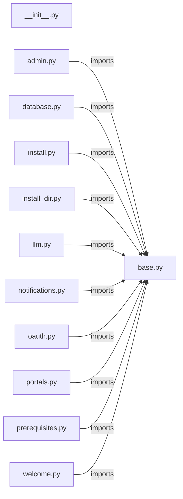

# `installer/pages/` — 12 module(s)

12 module(s).

## Dependencies

## `py:installer/pages/__init__.py`

- fan-in: 0, fan-out: 0

### Symbols
  _(no extracted symbols)_

## `py:installer/pages/admin.py`

- fan-in: 1, fan-out: 4

### Symbols
  - `AdminPage` (class) → py:installer/pages/admin.py:10 — `class AdminPage(WizardPage):`

## `py:installer/pages/base.py`

- fan-in: 10, fan-out: 3

### Symbols
  - `WizardPage` (class) → py:installer/pages/base.py:6 — `class WizardPage(tk.Frame, ABC):`

## `py:installer/pages/database.py`

- fan-in: 1, fan-out: 4

### Symbols
  - `DatabasePage` (class) → py:installer/pages/database.py:7 — `class DatabasePage(WizardPage):`

## `py:installer/pages/install.py`

- fan-in: 1, fan-out: 12

### Symbols
  - `InstallPage` (class) → py:installer/pages/install.py:41 — `class InstallPage(WizardPage):`

## `py:installer/pages/install_dir.py`

- fan-in: 1, fan-out: 6

### Symbols
  - `_default_install_path` (function) → py:installer/pages/install_dir.py:10 — `def _default_install_path() -> str:`
  - `InstallDirPage` (class) → py:installer/pages/install_dir.py:19 — `class InstallDirPage(WizardPage):`

## `py:installer/pages/llm.py`

- fan-in: 1, fan-out: 5

### Symbols
  - `LLMPage` (class) → py:installer/pages/llm.py:10 — `class LLMPage(WizardPage):`

## `py:installer/pages/notifications.py`

- fan-in: 1, fan-out: 4

### Symbols
  - `NotificationsPage` (class) → py:installer/pages/notifications.py:8 — `class NotificationsPage(WizardPage):`

## `py:installer/pages/oauth.py`

- fan-in: 1, fan-out: 4

### Symbols
  - `OAuthPage` (class) → py:installer/pages/oauth.py:29 — `class OAuthPage(WizardPage):`

## `py:installer/pages/portals.py`

- fan-in: 1, fan-out: 3

### Symbols
  - `PortalsPage` (class) → py:installer/pages/portals.py:16 — `class PortalsPage(WizardPage):`

## `py:installer/pages/prerequisites.py`

- fan-in: 1, fan-out: 9

### Symbols
  - `PrerequisitesPage` (class) → py:installer/pages/prerequisites.py:13 — `class PrerequisitesPage(WizardPage):`

## `py:installer/pages/welcome.py`

- fan-in: 1, fan-out: 3

### Symbols
  - `WelcomePage` (class) → py:installer/pages/welcome.py:37 — `class WelcomePage(WizardPage):`
