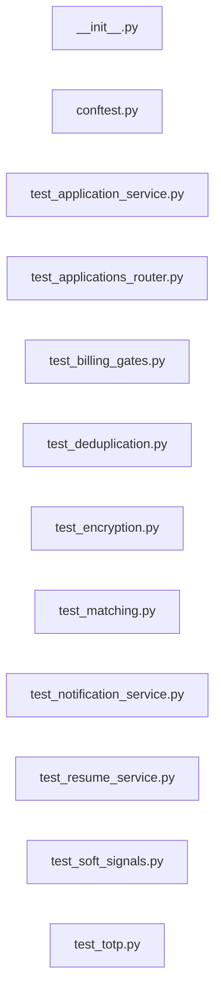

# `tests/unit/` — 12 module(s)

12 module(s).

## Dependencies

## `py:tests/unit/__init__.py`

- fan-in: 0, fan-out: 0

### Symbols
  _(no extracted symbols)_

## `py:tests/unit/conftest.py`

- fan-in: 0, fan-out: 3

### Symbols
  _(no extracted symbols)_

## `py:tests/unit/test_application_service.py`

- fan-in: 0, fan-out: 14

### Symbols
  - `_make_app` (function) → py:tests/unit/test_application_service.py:18 — `def _make_app(status: ApplicationStatus, applied_at=None):`
  - `_make_db_with_app` (function) → py:tests/unit/test_application_service.py:27 — `def _make_db_with_app(app_obj):`
  - `test_valid_transition` (function) → py:tests/unit/test_application_service.py:57 — `async def test_valid_transition(from_status, to_status):`
  - `test_invalid_transition_raises` (function) → py:tests/unit/test_application_service.py:79 — `async def test_invalid_transition_raises(from_status, to_status):`
  - `test_daily_cap_skips_apply` (function) → py:tests/unit/test_application_service.py:93 — `async def test_daily_cap_skips_apply():`
  - `test_paused_user_skips_apply` (function) → py:tests/unit/test_application_service.py:132 — `async def test_paused_user_skips_apply():`
  - `test_expired_pause_allows_apply` (function) → py:tests/unit/test_application_service.py:149 — `async def test_expired_pause_allows_apply():`
  - `test_queue_for_hitl_creates_pending_record` (function) → py:tests/unit/test_application_service.py:169 — `async def test_queue_for_hitl_creates_pending_record():`

## `py:tests/unit/test_applications_router.py`

- fan-in: 0, fan-out: 22

### Symbols
  - `_make_user` (function) → py:tests/unit/test_applications_router.py:18 — `def _make_user(schema="u_test"):`
  - `_make_prefs` (function) → py:tests/unit/test_applications_router.py:25 — `def _make_prefs(**kwargs):`
  - `_mock_tenant_db` (function) → py:tests/unit/test_applications_router.py:39 — `def _mock_tenant_db(prefs):`
  - `test_pause_sets_paused_flag` (function) → py:tests/unit/test_applications_router.py:58 — `async def test_pause_sets_paused_flag():`
  - `test_delete_pause_clears_flags` (function) → py:tests/unit/test_applications_router.py:76 — `async def test_delete_pause_clears_flags():`
  - `test_add_company_blacklist` (function) → py:tests/unit/test_applications_router.py:99 — `async def test_add_company_blacklist():`
  - `test_remove_company_blacklist` (function) → py:tests/unit/test_applications_router.py:116 — `async def test_remove_company_blacklist():`
  - `test_add_title_blacklist` (function) → py:tests/unit/test_applications_router.py:136 — `async def test_add_title_blacklist():`
  - `test_remove_title_blacklist` (function) → py:tests/unit/test_applications_router.py:153 — `async def test_remove_title_blacklist():`
  - `test_withdraw_calls_transition_status` (function) → py:tests/unit/test_applications_router.py:173 — `async def test_withdraw_calls_transition_status():`

## `py:tests/unit/test_billing_gates.py`

- fan-in: 0, fan-out: 24

### Symbols
  - `reset_plan_states` (function) → py:tests/unit/test_billing_gates.py:9 — `def reset_plan_states():`
  - `_user` (function) → py:tests/unit/test_billing_gates.py:16 — `def _user(tier: str):`
  - `test_all_gates_return_true_when_plan_disabled` (function) → py:tests/unit/test_billing_gates.py:22 — `def test_all_gates_return_true_when_plan_disabled():`
  - `test_activate_plan_sets_enabled` (function) → py:tests/unit/test_billing_gates.py:30 — `def test_activate_plan_sets_enabled():`
  - `test_activate_unknown_plan_raises` (function) → py:tests/unit/test_billing_gates.py:36 — `def test_activate_unknown_plan_raises():`
  - `test_portal_gate_enforces_limit_after_activation` (function) → py:tests/unit/test_billing_gates.py:41 — `def test_portal_gate_enforces_limit_after_activation():`
  - `test_apply_gate_enforces_limit_after_activation` (function) → py:tests/unit/test_billing_gates.py:48 — `def test_apply_gate_enforces_limit_after_activation():`
  - `test_llm_gate_respects_plan_after_activation` (function) → py:tests/unit/test_billing_gates.py:55 — `def test_llm_gate_respects_plan_after_activation():`
  - `test_enterprise_unlimited_portals_after_activation` (function) → py:tests/unit/test_billing_gates.py:61 — `def test_enterprise_unlimited_portals_after_activation():`
  - `test_activate_free_tier_already_enabled` (function) → py:tests/unit/test_billing_gates.py:67 — `def test_activate_free_tier_already_enabled():`

## `py:tests/unit/test_deduplication.py`

- fan-in: 0, fan-out: 34

### Symbols
  - `_make_raw_job` (function) → py:tests/unit/test_deduplication.py:27 — `def _make_raw_job(portal_job_id: str, title: str = "Software Engineer", **overrides) -> dict:`
  - `mock_db` (function) → py:tests/unit/test_deduplication.py:47 — `def mock_db():`
  - `TestStoreJobsEmptyInput` (class) → py:tests/unit/test_deduplication.py:59 — `class TestStoreJobsEmptyInput:`
  - `TestStoreJobsDeduplication` (class) → py:tests/unit/test_deduplication.py:84 — `class TestStoreJobsDeduplication:`
  - `TestStoreJobsCommitBehaviour` (class) → py:tests/unit/test_deduplication.py:148 — `class TestStoreJobsCommitBehaviour:`
  - `TestStoreJobsPayload` (class) → py:tests/unit/test_deduplication.py:169 — `class TestStoreJobsPayload:`
  - `TestMarkJobsInactive` (class) → py:tests/unit/test_deduplication.py:213 — `class TestMarkJobsInactive:`
  - `TestDeduplicationKeyUniqueness` (class) → py:tests/unit/test_deduplication.py:234 — `class TestDeduplicationKeyUniqueness:`

## `py:tests/unit/test_encryption.py`

- fan-in: 0, fan-out: 6

### Symbols
  _(no extracted symbols)_

## `py:tests/unit/test_matching.py`

- fan-in: 0, fan-out: 29

### Symbols
  - `TestComputeMatchReturnShape` (class) → py:tests/unit/test_matching.py:9 — `class TestComputeMatchReturnShape:`
  - `TestComputeMatchEdgeCases` (class) → py:tests/unit/test_matching.py:25 — `class TestComputeMatchEdgeCases:`
  - `TestComputeMatchExactMatching` (class) → py:tests/unit/test_matching.py:58 — `class TestComputeMatchExactMatching:`
  - `TestComputeMatchCaseInsensitive` (class) → py:tests/unit/test_matching.py:83 — `class TestComputeMatchCaseInsensitive:`
  - `TestComputeMatchScore` (class) → py:tests/unit/test_matching.py:96 — `class TestComputeMatchScore:`
  - `TestMeetsThreshold` (class) → py:tests/unit/test_matching.py:123 — `class TestMeetsThreshold:`
  - `TestComputeMatchBlendedScore` (class) → py:tests/unit/test_matching.py:141 — `class TestComputeMatchBlendedScore:`

## `py:tests/unit/test_notification_service.py`

- fan-in: 0, fan-out: 20

### Symbols
  - `_make_user` (function) → py:tests/unit/test_notification_service.py:17 — `def _make_user(email="user@example.com"):`
  - `_make_prefs` (function) → py:tests/unit/test_notification_service.py:24 — `def _make_prefs(platform="telegram", telegram_chat_id="12345", discord_channel_id=None):`
  - `_make_shared_db` (function) → py:tests/unit/test_notification_service.py:33 — `def _make_shared_db(user):`
  - `_make_tenant_db` (function) → py:tests/unit/test_notification_service.py:41 — `def _make_tenant_db(prefs):`
  - `test_telegram_user_gets_three_channels` (function) → py:tests/unit/test_notification_service.py:56 — `async def test_telegram_user_gets_three_channels():`
  - `test_discord_user_gets_three_channels` (function) → py:tests/unit/test_notification_service.py:92 — `async def test_discord_user_gets_three_channels():`
  - `test_new_match_event_only_inapp` (function) → py:tests/unit/test_notification_service.py:126 — `async def test_new_match_event_only_inapp():`
  - `test_channel_failure_does_not_propagate` (function) → py:tests/unit/test_notification_service.py:162 — `async def test_channel_failure_does_not_propagate():`
  - `test_notification_log_rows_created_per_channel` (function) → py:tests/unit/test_notification_service.py:191 — `async def test_notification_log_rows_created_per_channel():`

## `py:tests/unit/test_resume_service.py`

- fan-in: 0, fan-out: 14

### Symbols
  - `test_parse_master_resume_returns_text` (function) → py:tests/unit/test_resume_service.py:17 — `async def test_parse_master_resume_returns_text():`
  - `test_parse_master_resume_multi_page` (function) → py:tests/unit/test_resume_service.py:40 — `async def test_parse_master_resume_multi_page():`
  - `test_generate_tailored_resume_parses_json` (function) → py:tests/unit/test_resume_service.py:86 — `async def test_generate_tailored_resume_parses_json():`
  - `test_generate_tailored_resume_strips_markdown_fences` (function) → py:tests/unit/test_resume_service.py:106 — `async def test_generate_tailored_resume_strips_markdown_fences():`
  - `test_render_tailored_pdf_returns_minio_key` (function) → py:tests/unit/test_resume_service.py:129 — `async def test_render_tailored_pdf_returns_minio_key():`

## `py:tests/unit/test_soft_signals.py`

- fan-in: 0, fan-out: 9

### Symbols
  - `reset_soft_signals` (function) → py:tests/unit/test_soft_signals.py:6 — `def reset_soft_signals():`
  - `test_score_returns_zero_when_disabled` (function) → py:tests/unit/test_soft_signals.py:12 — `def test_score_returns_zero_when_disabled():`
  - `test_remote_job_with_remote_preference_scores_positive_when_enabled` (function) → py:tests/unit/test_soft_signals.py:21 — `def test_remote_job_with_remote_preference_scores_positive_when_enabled():`
  - `test_full_remote_preference_also_matches` (function) → py:tests/unit/test_soft_signals.py:30 — `def test_full_remote_preference_also_matches():`
  - `test_company_size_match_adds_score_when_enabled` (function) → py:tests/unit/test_soft_signals.py:39 — `def test_company_size_match_adds_score_when_enabled():`
  - `test_score_never_exceeds_0_05` (function) → py:tests/unit/test_soft_signals.py:48 — `def test_score_never_exceeds_0_05():`
  - `test_score_is_zero_when_no_match` (function) → py:tests/unit/test_soft_signals.py:57 — `def test_score_is_zero_when_no_match():`
  - `test_activate_soft_signals_sets_enabled` (function) → py:tests/unit/test_soft_signals.py:66 — `def test_activate_soft_signals_sets_enabled():`

## `py:tests/unit/test_totp.py`

- fan-in: 0, fan-out: 1

### Symbols
  - `test_totp_verify_valid_code` (function) → py:tests/unit/test_totp.py:4 — `def test_totp_verify_valid_code():`
  - `test_totp_verify_wrong_code` (function) → py:tests/unit/test_totp.py:11 — `def test_totp_verify_wrong_code():`
  - `test_totp_provisioning_uri` (function) → py:tests/unit/test_totp.py:17 — `def test_totp_provisioning_uri():`
