# `app/crawlers/` — 10 module(s)

10 module(s).

## Dependencies

```mermaid
flowchart LR
  n_py_app_crawlers___init___py["__init__.py"]
  n_py_app_crawlers_anti_detection_py["anti_detection.py"]
  n_py_app_crawlers_base_py["base.py"]
  n_py_app_crawlers_glassdoor_py["glassdoor.py"]
  n_py_app_crawlers_indeed_py["indeed.py"]
  n_py_app_crawlers_linkedin_py["linkedin.py"]
  n_py_app_crawlers_monster_py["monster.py"]
  n_py_app_crawlers_naukri_py["naukri.py"]
  n_py_app_crawlers_session_manager_py["session_manager.py"]
  n_py_app_crawlers_shine_py["shine.py"]
  n_py_app_crawlers_glassdoor_py -->|imports| n_py_app_crawlers_base_py
  n_py_app_crawlers_glassdoor_py -->|imports| n_py_app_crawlers_anti_detection_py
  n_py_app_crawlers_glassdoor_py -->|imports| n_py_app_crawlers_session_manager_py
  n_py_app_crawlers_glassdoor_py -->|calls| n_py_app_crawlers_anti_detection_py
  n_py_app_crawlers_glassdoor_py -->|calls| n_py_app_crawlers_anti_detection_py
  n_py_app_crawlers_glassdoor_py -->|calls| n_py_app_crawlers_anti_detection_py
  n_py_app_crawlers_glassdoor_py -->|calls| n_py_app_crawlers_anti_detection_py
  n_py_app_crawlers_glassdoor_py -->|calls| n_py_app_crawlers_session_manager_py
  n_py_app_crawlers_glassdoor_py -->|calls| n_py_app_crawlers_anti_detection_py
  n_py_app_crawlers_glassdoor_py -->|calls| n_py_app_crawlers_anti_detection_py
  n_py_app_crawlers_glassdoor_py -->|calls| n_py_app_crawlers_session_manager_py
  n_py_app_crawlers_glassdoor_py -->|calls| n_py_app_crawlers_base_py
  n_py_app_crawlers_glassdoor_py -->|calls| n_py_app_crawlers_base_py
  n_py_app_crawlers_glassdoor_py -->|calls| n_py_app_crawlers_anti_detection_py
  n_py_app_crawlers_glassdoor_py -->|calls| n_py_app_crawlers_base_py
  n_py_app_crawlers_glassdoor_py -->|calls| n_py_app_crawlers_base_py
  n_py_app_crawlers_glassdoor_py -->|calls| n_py_app_crawlers_base_py
  n_py_app_crawlers_indeed_py -->|imports| n_py_app_crawlers_base_py
  n_py_app_crawlers_indeed_py -->|imports| n_py_app_crawlers_anti_detection_py
  n_py_app_crawlers_indeed_py -->|imports| n_py_app_crawlers_session_manager_py
  n_py_app_crawlers_indeed_py -->|calls| n_py_app_crawlers_anti_detection_py
  n_py_app_crawlers_indeed_py -->|calls| n_py_app_crawlers_anti_detection_py
  n_py_app_crawlers_indeed_py -->|calls| n_py_app_crawlers_anti_detection_py
  n_py_app_crawlers_indeed_py -->|calls| n_py_app_crawlers_anti_detection_py
  n_py_app_crawlers_indeed_py -->|calls| n_py_app_crawlers_session_manager_py
  n_py_app_crawlers_indeed_py -->|calls| n_py_app_crawlers_base_py
  n_py_app_crawlers_indeed_py -->|calls| n_py_app_crawlers_anti_detection_py
  n_py_app_crawlers_indeed_py -->|calls| n_py_app_crawlers_anti_detection_py
  n_py_app_crawlers_indeed_py -->|calls| n_py_app_crawlers_base_py
  n_py_app_crawlers_indeed_py -->|calls| n_py_app_crawlers_anti_detection_py
  n_py_app_crawlers_indeed_py -->|calls| n_py_app_crawlers_base_py
  n_py_app_crawlers_indeed_py -->|calls| n_py_app_crawlers_anti_detection_py
  n_py_app_crawlers_indeed_py -->|calls| n_py_app_crawlers_base_py
  n_py_app_crawlers_indeed_py -->|calls| n_py_app_crawlers_anti_detection_py
  n_py_app_crawlers_linkedin_py -->|imports| n_py_app_crawlers_base_py
  n_py_app_crawlers_linkedin_py -->|imports| n_py_app_crawlers_anti_detection_py
  n_py_app_crawlers_linkedin_py -->|imports| n_py_app_crawlers_session_manager_py
  n_py_app_crawlers_linkedin_py -->|calls| n_py_app_crawlers_anti_detection_py
  n_py_app_crawlers_linkedin_py -->|calls| n_py_app_crawlers_anti_detection_py
  n_py_app_crawlers_linkedin_py -->|calls| n_py_app_crawlers_anti_detection_py
  n_py_app_crawlers_linkedin_py -->|calls| n_py_app_crawlers_anti_detection_py
  n_py_app_crawlers_linkedin_py -->|calls| n_py_app_crawlers_session_manager_py
  n_py_app_crawlers_linkedin_py -->|calls| n_py_app_crawlers_anti_detection_py
  n_py_app_crawlers_linkedin_py -->|calls| n_py_app_crawlers_anti_detection_py
  n_py_app_crawlers_linkedin_py -->|calls| n_py_app_crawlers_anti_detection_py
  n_py_app_crawlers_linkedin_py -->|calls| n_py_app_crawlers_session_manager_py
  n_py_app_crawlers_linkedin_py -->|calls| n_py_app_crawlers_base_py
  n_py_app_crawlers_linkedin_py -->|calls| n_py_app_crawlers_base_py
  n_py_app_crawlers_linkedin_py -->|calls| n_py_app_crawlers_base_py
  n_py_app_crawlers_linkedin_py -->|calls| n_py_app_crawlers_anti_detection_py
  n_py_app_crawlers_linkedin_py -->|calls| n_py_app_crawlers_base_py
  n_py_app_crawlers_linkedin_py -->|calls| n_py_app_crawlers_anti_detection_py
  n_py_app_crawlers_linkedin_py -->|calls| n_py_app_crawlers_base_py
  n_py_app_crawlers_linkedin_py -->|calls| n_py_app_crawlers_anti_detection_py
  n_py_app_crawlers_linkedin_py -->|calls| n_py_app_crawlers_anti_detection_py
  n_py_app_crawlers_linkedin_py -->|calls| n_py_app_crawlers_base_py
  n_py_app_crawlers_linkedin_py -->|calls| n_py_app_crawlers_anti_detection_py
  n_py_app_crawlers_linkedin_py -->|calls| n_py_app_crawlers_anti_detection_py
  n_py_app_crawlers_monster_py -->|imports| n_py_app_crawlers_base_py
  n_py_app_crawlers_monster_py -->|imports| n_py_app_crawlers_anti_detection_py
  n_py_app_crawlers_monster_py -->|calls| n_py_app_crawlers_anti_detection_py
  n_py_app_crawlers_monster_py -->|calls| n_py_app_crawlers_anti_detection_py
  n_py_app_crawlers_monster_py -->|calls| n_py_app_crawlers_anti_detection_py
  n_py_app_crawlers_monster_py -->|calls| n_py_app_crawlers_anti_detection_py
  n_py_app_crawlers_monster_py -->|calls| n_py_app_crawlers_base_py
  n_py_app_crawlers_monster_py -->|calls| n_py_app_crawlers_anti_detection_py
  n_py_app_crawlers_monster_py -->|calls| n_py_app_crawlers_anti_detection_py
  n_py_app_crawlers_monster_py -->|calls| n_py_app_crawlers_base_py
  n_py_app_crawlers_monster_py -->|calls| n_py_app_crawlers_anti_detection_py
  n_py_app_crawlers_monster_py -->|calls| n_py_app_crawlers_base_py
  n_py_app_crawlers_monster_py -->|calls| n_py_app_crawlers_anti_detection_py
  n_py_app_crawlers_monster_py -->|calls| n_py_app_crawlers_base_py
  n_py_app_crawlers_naukri_py -->|imports| n_py_app_crawlers_base_py
  n_py_app_crawlers_naukri_py -->|imports| n_py_app_crawlers_anti_detection_py
  n_py_app_crawlers_naukri_py -->|imports| n_py_app_crawlers_session_manager_py
  n_py_app_crawlers_naukri_py -->|calls| n_py_app_crawlers_anti_detection_py
  n_py_app_crawlers_naukri_py -->|calls| n_py_app_crawlers_anti_detection_py
  n_py_app_crawlers_naukri_py -->|calls| n_py_app_crawlers_anti_detection_py
  n_py_app_crawlers_naukri_py -->|calls| n_py_app_crawlers_anti_detection_py
  n_py_app_crawlers_naukri_py -->|calls| n_py_app_crawlers_anti_detection_py
  %% +30 more edge(s)
```

## `py:app/crawlers/__init__.py`

- fan-in: 0, fan-out: 0

### Symbols
  _(no extracted symbols)_

## `py:app/crawlers/anti_detection.py`

- fan-in: 68, fan-out: 4

### Symbols
  - `random_user_agent` (function) → py:app/crawlers/anti_detection.py:37 — `def random_user_agent() -> str:`
  - `random_viewport` (function) → py:app/crawlers/anti_detection.py:41 — `def random_viewport() -> dict:`
  - `human_delay` (function) → py:app/crawlers/anti_detection.py:45 — `async def human_delay(portal: str = "default") -> None:`
  - `micro_delay` (function) → py:app/crawlers/anti_detection.py:51 — `async def micro_delay() -> None:`
  - `human_type` (function) → py:app/crawlers/anti_detection.py:56 — `async def human_type(page: Page, selector: str, text: str) -> None:`
  - `random_scroll` (function) → py:app/crawlers/anti_detection.py:65 — `async def random_scroll(page: Page) -> None:`
  - `configure_stealth_context` (function) → py:app/crawlers/anti_detection.py:72 — `async def configure_stealth_context(context: BrowserContext) -> None:`

## `py:app/crawlers/base.py`

- fan-in: 39, fan-out: 5

### Symbols
  - `RawJob` (class) → py:app/crawlers/base.py:17 — `class RawJob:`
  - `ApplicationReceipt` (class) → py:app/crawlers/base.py:35 — `class ApplicationReceipt:`
  - `BaseCrawler` (class) → py:app/crawlers/base.py:44 — `class BaseCrawler(ABC):`

## `py:app/crawlers/glassdoor.py`

- fan-in: 3, fan-out: 24

### Symbols
  - `GlassdoorCrawler` (class) → py:app/crawlers/glassdoor.py:19 — `class GlassdoorCrawler(BaseCrawler):`

## `py:app/crawlers/indeed.py`

- fan-in: 15, fan-out: 27

### Symbols
  - `IndeedCrawler` (class) → py:app/crawlers/indeed.py:21 — `class IndeedCrawler(BaseCrawler):`

## `py:app/crawlers/linkedin.py`

- fan-in: 3, fan-out: 34

### Symbols
  - `LinkedInCrawler` (class) → py:app/crawlers/linkedin.py:25 — `class LinkedInCrawler(BaseCrawler):`

## `py:app/crawlers/monster.py`

- fan-in: 0, fan-out: 24

### Symbols
  - `MonsterCrawler` (class) → py:app/crawlers/monster.py:20 — `class MonsterCrawler(BaseCrawler):`

## `py:app/crawlers/naukri.py`

- fan-in: 11, fan-out: 34

### Symbols
  - `NaukriCrawler` (class) → py:app/crawlers/naukri.py:25 — `class NaukriCrawler(BaseCrawler):`

## `py:app/crawlers/session_manager.py`

- fan-in: 16, fan-out: 21

### Symbols
  - `_get_redis` (function) → py:app/crawlers/session_manager.py:27 — `async def _get_redis() -> aioredis.Redis:`
  - `_get_browser` (function) → py:app/crawlers/session_manager.py:34 — `async def _get_browser() -> Browser:`
  - `get_context` (function) → py:app/crawlers/session_manager.py:50 — `async def get_context(portal: str) -> BrowserContext:`
  - `save_session_cookies` (function) → py:app/crawlers/session_manager.py:85 — `async def save_session_cookies(portal: str, context: BrowserContext) -> None:`
  - `load_session_cookies` (function) → py:app/crawlers/session_manager.py:95 — `async def load_session_cookies(portal: str) -> Optional[list]:`
  - `clear_session` (function) → py:app/crawlers/session_manager.py:109 — `async def clear_session(portal: str) -> None:`
  - `handle_session_expiry` (function) → py:app/crawlers/session_manager.py:122 — `async def handle_session_expiry(`
  - `save_crawl_state` (function) → py:app/crawlers/session_manager.py:151 — `async def save_crawl_state(portal: str, state: dict) -> None:`
  - `load_crawl_state` (function) → py:app/crawlers/session_manager.py:157 — `async def load_crawl_state(portal: str) -> Optional[dict]:`
  - `shutdown` (function) → py:app/crawlers/session_manager.py:164 — `async def shutdown() -> None:`

## `py:app/crawlers/shine.py`

- fan-in: 0, fan-out: 24

### Symbols
  - `ShineCrawler` (class) → py:app/crawlers/shine.py:20 — `class ShineCrawler(BaseCrawler):`
