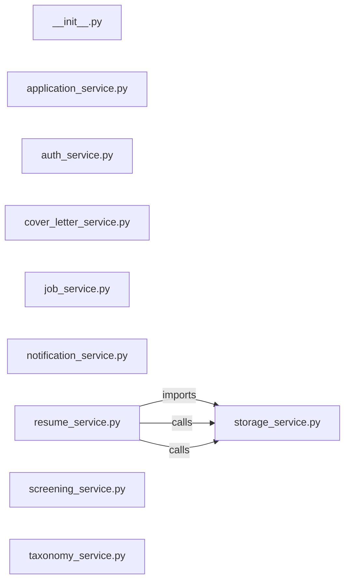

# `app/services/` — 10 module(s)

10 module(s).

## Dependencies

## `py:app/services/__init__.py`

- fan-in: 29, fan-out: 0

### Symbols
  _(no extracted symbols)_

## `py:app/services/application_service.py`

- fan-in: 19, fan-out: 32

### Symbols
  - `_crawler_for_portal` (function) → py:app/services/application_service.py:60 — `def _crawler_for_portal(portal: str) -> BaseCrawler:`
  - `apply_to_job` (function) → py:app/services/application_service.py:79 — `async def apply_to_job(`
  - `transition_status` (function) → py:app/services/application_service.py:198 — `async def transition_status(`
  - `queue_for_hitl` (function) → py:app/services/application_service.py:238 — `async def queue_for_hitl(`

## `py:app/services/auth_service.py`

- fan-in: 9, fan-out: 12

### Symbols
  - `create_access_token` (function) → py:app/services/auth_service.py:61 — `def create_access_token(data: dict, expires_delta: Optional[timedelta] = None) -> str:`
  - `decode_access_token` (function) → py:app/services/auth_service.py:70 — `def decode_access_token(token: str) -> dict:`
  - `hash_password` (function) → py:app/services/auth_service.py:83 — `def hash_password(password: str) -> str:`
  - `verify_password` (function) → py:app/services/auth_service.py:87 — `def verify_password(plain: str, hashed: str) -> bool:`
  - `build_user_thumbprint` (function) → py:app/services/auth_service.py:91 — `def build_user_thumbprint(email: str, phone: str) -> tuple[str, str]:`

## `py:app/services/cover_letter_service.py`

- fan-in: 0, fan-out: 5

### Symbols
  - `generate_cover_letter` (function) → py:app/services/cover_letter_service.py:8 — `async def generate_cover_letter(`

## `py:app/services/job_service.py`

- fan-in: 31, fan-out: 9

### Symbols
  - `store_jobs` (function) → py:app/services/job_service.py:17 — `async def store_jobs(`
  - `get_matched_jobs_for_user` (function) → py:app/services/job_service.py:94 — `async def get_matched_jobs_for_user(`
  - `get_unmatched_jobs` (function) → py:app/services/job_service.py:140 — `async def get_unmatched_jobs(`
  - `mark_jobs_inactive` (function) → py:app/services/job_service.py:166 — `async def mark_jobs_inactive(`

## `py:app/services/notification_service.py`

- fan-in: 10, fan-out: 17

### Symbols
  - `notify` (function) → py:app/services/notification_service.py:25 — `async def notify(`
  - `_log_notification` (function) → py:app/services/notification_service.py:129 — `async def _log_notification(`
  - `_build_html` (function) → py:app/services/notification_service.py:150 — `def _build_html(subject: str, body: str, deep_link: str | None) -> str:`
  - `_build_plain` (function) → py:app/services/notification_service.py:157 — `def _build_plain(subject: str, body: str, deep_link: str | None) -> str:`

## `py:app/services/resume_service.py`

- fan-in: 11, fan-out: 18

### Symbols
  - `_render_html` (function) → py:app/services/resume_service.py:70 — `def _render_html(resume_data: dict) -> str:`
  - `parse_master_resume` (function) → py:app/services/resume_service.py:120 — `async def parse_master_resume(minio_key: str) -> str:`
  - `generate_tailored_resume` (function) → py:app/services/resume_service.py:130 — `async def generate_tailored_resume(`
  - `render_tailored_pdf` (function) → py:app/services/resume_service.py:162 — `async def render_tailored_pdf(`
  - `store_tailored_resume` (function) → py:app/services/resume_service.py:190 — `async def store_tailored_resume(`

## `py:app/services/screening_service.py`

- fan-in: 0, fan-out: 8

### Symbols
  - `_fingerprint` (function) → py:app/services/screening_service.py:16 — `def _fingerprint(question: str) -> str:`
  - `_build_llm_prompt` (function) → py:app/services/screening_service.py:21 — `def _build_llm_prompt(question: str, portal: str, user_profile: dict) -> str:`
  - `answer_screening_question` (function) → py:app/services/screening_service.py:35 — `async def answer_screening_question(`
  - `get_saved_answers` (function) → py:app/services/screening_service.py:80 — `async def get_saved_answers(portal: str, db: AsyncSession) -> dict[str, str]:`

## `py:app/services/storage_service.py`

- fan-in: 5, fan-out: 5

### Symbols
  - `_ensure_bucket` (function) → py:app/services/storage_service.py:14 — `def _ensure_bucket() -> None:`
  - `upload_resume` (function) → py:app/services/storage_service.py:19 — `async def upload_resume(schema_name: str, content: bytes, filename: str) -> str:`
  - `download_resume` (function) → py:app/services/storage_service.py:34 — `async def download_resume(key: str) -> bytes:`
  - `delete_object` (function) → py:app/services/storage_service.py:39 — `async def delete_object(key: str) -> None:`

## `py:app/services/taxonomy_service.py`

- fan-in: 2, fan-out: 14

### Symbols
  - `get_all_active_skills` (function) → py:app/services/taxonomy_service.py:22 — `async def get_all_active_skills(db: AsyncSession, use_cache: bool = True) -> list[str]:`
  - `invalidate_cache` (function) → py:app/services/taxonomy_service.py:45 — `def invalidate_cache() -> None:`
  - `seed_from_file` (function) → py:app/services/taxonomy_service.py:50 — `async def seed_from_file(db: AsyncSession) -> list[str]:`
  - `lookup_skill` (function) → py:app/services/taxonomy_service.py:93 — `async def lookup_skill(skill_name: str, db: AsyncSession) -> Optional[SkillTaxonomy]:`
  - `add_skill` (function) → py:app/services/taxonomy_service.py:103 — `async def add_skill(`
  - `get_skills_by_category` (function) → py:app/services/taxonomy_service.py:138 — `async def get_skills_by_category(category: str, db: AsyncSession) -> list[SkillTaxonomy]:`
  - `get_keyword_sets_for_crawling` (function) → py:app/services/taxonomy_service.py:150 — `async def get_keyword_sets_for_crawling(db: AsyncSession) -> dict[str, list[str]]:`
