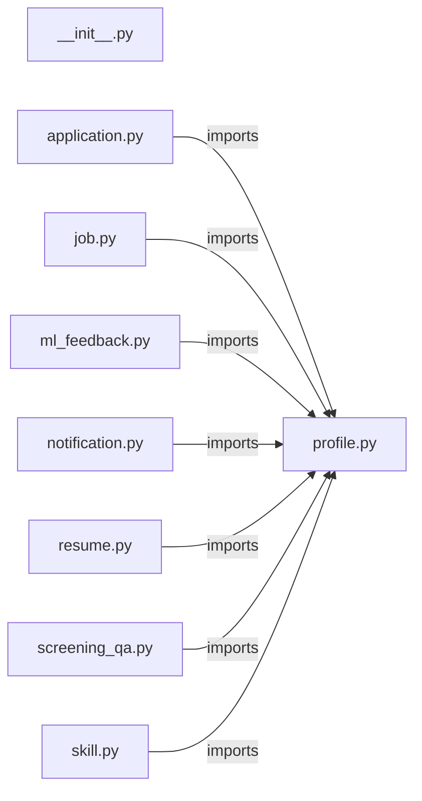

# `app/tenant_models/` — 9 module(s)

9 module(s).

## Dependencies

## `py:app/tenant_models/__init__.py`

- fan-in: 1, fan-out: 0

### Symbols
  _(no extracted symbols)_

## `py:app/tenant_models/application.py`

- fan-in: 18, fan-out: 6

### Symbols
  - `ApplicationStatus` (class) → py:app/tenant_models/application.py:9 — `class ApplicationStatus(str, enum.Enum):`
  - `ApplicationFailureReason` (class) → py:app/tenant_models/application.py:23 — `class ApplicationFailureReason(str, enum.Enum):`
  - `JobApplication` (class) → py:app/tenant_models/application.py:31 — `class JobApplication(TenantBase):`
  - `ApplicationStatusLog` (class) → py:app/tenant_models/application.py:71 — `class ApplicationStatusLog(TenantBase):`

## `py:app/tenant_models/job.py`

- fan-in: 6, fan-out: 5

### Symbols
  - `MatchedJob` (class) → py:app/tenant_models/job.py:8 — `class MatchedJob(TenantBase):`

## `py:app/tenant_models/ml_feedback.py`

- fan-in: 6, fan-out: 6

### Symbols
  - `OutcomeSignal` (class) → py:app/tenant_models/ml_feedback.py:9 — `class OutcomeSignal(str, enum.Enum):`
  - `MLFeedback` (class) → py:app/tenant_models/ml_feedback.py:17 — `class MLFeedback(TenantBase):`

## `py:app/tenant_models/notification.py`

- fan-in: 5, fan-out: 6

### Symbols
  - `NotificationChannel` (class) → py:app/tenant_models/notification.py:9 — `class NotificationChannel(str, enum.Enum):`
  - `NotificationLog` (class) → py:app/tenant_models/notification.py:16 — `class NotificationLog(TenantBase):`

## `py:app/tenant_models/profile.py`

- fan-in: 24, fan-out: 5

### Symbols
  - `TenantBase` (class) → py:app/tenant_models/profile.py:16 — `class TenantBase(DeclarativeBase):`
  - `WFHPreference` (class) → py:app/tenant_models/profile.py:21 — `class WFHPreference(str, enum.Enum):`
  - `LLMChoice` (class) → py:app/tenant_models/profile.py:28 — `class LLMChoice(str, enum.Enum):`
  - `NotificationPlatform` (class) → py:app/tenant_models/profile.py:33 — `class NotificationPlatform(str, enum.Enum):`
  - `StatusCheckFrequency` (class) → py:app/tenant_models/profile.py:38 — `class StatusCheckFrequency(int, enum.Enum):`
  - `UserProfile` (class) → py:app/tenant_models/profile.py:45 — `class UserProfile(TenantBase):`
  - `UserPreferences` (class) → py:app/tenant_models/profile.py:75 — `class UserPreferences(TenantBase):`

## `py:app/tenant_models/resume.py`

- fan-in: 5, fan-out: 5

### Symbols
  - `MasterResume` (class) → py:app/tenant_models/resume.py:8 — `class MasterResume(TenantBase):`
  - `TailoredResume` (class) → py:app/tenant_models/resume.py:22 — `class TailoredResume(TenantBase):`

## `py:app/tenant_models/screening_qa.py`

- fan-in: 4, fan-out: 5

### Symbols
  - `PortalScreeningAnswer` (class) → py:app/tenant_models/screening_qa.py:8 — `class PortalScreeningAnswer(TenantBase):`
  - `MissingInfoLog` (class) → py:app/tenant_models/screening_qa.py:26 — `class MissingInfoLog(TenantBase):`

## `py:app/tenant_models/skill.py`

- fan-in: 4, fan-out: 5

### Symbols
  - `UserSkill` (class) → py:app/tenant_models/skill.py:8 — `class UserSkill(TenantBase):`
  - `SkillMatchCache` (class) → py:app/tenant_models/skill.py:23 — `class SkillMatchCache(TenantBase):`
