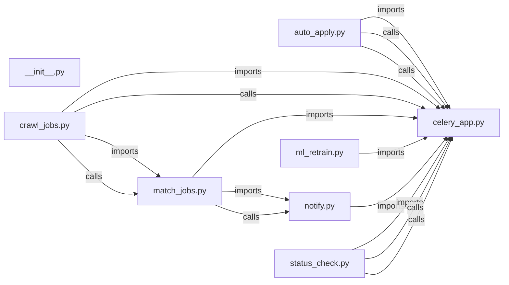

# `app/tasks/` — 8 module(s)

8 module(s).

## Dependencies

## `py:app/tasks/__init__.py`

- fan-in: 0, fan-out: 0

### Symbols
  _(no extracted symbols)_

## `py:app/tasks/auto_apply.py`

- fan-in: 0, fan-out: 34

### Symbols
  - `_run` (function) → py:app/tasks/auto_apply.py:18 — `def _run(coro):`
  - `auto_apply_for_all_users` (function) → py:app/tasks/auto_apply.py:24 — `def auto_apply_for_all_users(self):`
  - `apply_matched_jobs` (function) → py:app/tasks/auto_apply.py:48 — `def apply_matched_jobs(self, user_id: str, schema_name: str):`

## `py:app/tasks/celery_app.py`

- fan-in: 11, fan-out: 4

### Symbols
  _(no extracted symbols)_

## `py:app/tasks/crawl_jobs.py`

- fan-in: 2, fan-out: 27

### Symbols
  - `_import_crawler` (function) → py:app/tasks/crawl_jobs.py:38 — `def _import_crawler(portal_name: str):`
  - `_run_crawl` (function) → py:app/tasks/crawl_jobs.py:45 — `async def _run_crawl(portal_name: str) -> dict:`
  - `crawl_portal` (function) → py:app/tasks/crawl_jobs.py:165 — `def crawl_portal(self, portal_name: str):`

## `py:app/tasks/match_jobs.py`

- fan-in: 2, fan-out: 31

### Symbols
  - `_run_match_for_user` (function) → py:app/tasks/match_jobs.py:19 — `async def _run_match_for_user(user_id: str, schema_name: str) -> dict:`
  - `_run_match_all_users` (function) → py:app/tasks/match_jobs.py:119 — `async def _run_match_all_users() -> dict:`
  - `match_all_users` (function) → py:app/tasks/match_jobs.py:157 — `def match_all_users():`
  - `match_jobs_for_user` (function) → py:app/tasks/match_jobs.py:170 — `def match_jobs_for_user(user_id: str, schema_name: str):`

## `py:app/tasks/ml_retrain.py`

- fan-in: 0, fan-out: 25

### Symbols
  - `_retrain_for_user` (function) → py:app/tasks/ml_retrain.py:25 — `async def _retrain_for_user(user_id: str, schema_name: str) -> dict:`
  - `_retrain_all` (function) → py:app/tasks/ml_retrain.py:113 — `async def _retrain_all() -> dict:`
  - `retrain_all_user_models` (function) → py:app/tasks/ml_retrain.py:147 — `def retrain_all_user_models():`
  - `purge_stale_resumes` (function) → py:app/tasks/ml_retrain.py:159 — `def purge_stale_resumes():`
  - `_purge_stale_resumes_async` (function) → py:app/tasks/ml_retrain.py:172 — `async def _purge_stale_resumes_async():`
  - `retrain_user_model` (function) → py:app/tasks/ml_retrain.py:224 — `def retrain_user_model(user_id: str, schema_name: str):`

## `py:app/tasks/notify.py`

- fan-in: 4, fan-out: 12

### Symbols
  - `dispatch_activity_digest` (function) → py:app/tasks/notify.py:18 — `def dispatch_activity_digest(user_id: str, schema_name: str):`
  - `_async_digest` (function) → py:app/tasks/notify.py:23 — `async def _async_digest(user_id: str, schema_name: str) -> None:`

## `py:app/tasks/status_check.py`

- fan-in: 0, fan-out: 27

### Symbols
  - `_run` (function) → py:app/tasks/status_check.py:36 — `def _run(coro):`
  - `check_all_application_statuses` (function) → py:app/tasks/status_check.py:41 — `def check_all_application_statuses(self):`
  - `check_user_application_statuses` (function) → py:app/tasks/status_check.py:64 — `def check_user_application_statuses(self, user_id: str, schema_name: str):`
