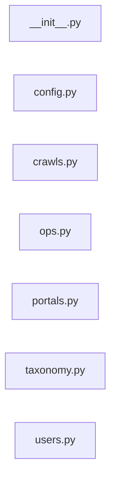

# `app/routers/admin/` — 7 module(s)

7 module(s).

## Dependencies

## `py:app/routers/admin/__init__.py`

- fan-in: 6, fan-out: 0

### Symbols
  _(no extracted symbols)_

## `py:app/routers/admin/config.py`

- fan-in: 0, fan-out: 9

### Symbols
  - `SystemConfigUpdate` (class) → py:app/routers/admin/config.py:11 — `class SystemConfigUpdate(BaseModel):`
  - `get_config` (function) → py:app/routers/admin/config.py:17 — `async def get_config(`
  - `update_config` (function) → py:app/routers/admin/config.py:28 — `async def update_config(`

## `py:app/routers/admin/crawls.py`

- fan-in: 0, fan-out: 9

### Symbols
  - `trigger_crawl` (function) → py:app/routers/admin/crawls.py:13 — `async def trigger_crawl(`

## `py:app/routers/admin/ops.py`

- fan-in: 0, fan-out: 9

### Symbols
  - `ops_dashboard` (function) → py:app/routers/admin/ops.py:14 — `async def ops_dashboard(`

## `py:app/routers/admin/portals.py`

- fan-in: 0, fan-out: 11

### Symbols
  - `list_portal_accounts` (function) → py:app/routers/admin/portals.py:14 — `async def list_portal_accounts(`
  - `update_portal_health` (function) → py:app/routers/admin/portals.py:32 — `async def update_portal_health(`

## `py:app/routers/admin/taxonomy.py`

- fan-in: 0, fan-out: 11

### Symbols
  - `SkillReviewAction` (class) → py:app/routers/admin/taxonomy.py:13 — `class SkillReviewAction(BaseModel):`
  - `list_pending_skills` (function) → py:app/routers/admin/taxonomy.py:20 — `async def list_pending_skills(`
  - `review_skill` (function) → py:app/routers/admin/taxonomy.py:34 — `async def review_skill(`

## `py:app/routers/admin/users.py`

- fan-in: 0, fan-out: 13

### Symbols
  - `list_users` (function) → py:app/routers/admin/users.py:14 — `async def list_users(`
  - `suspend_user` (function) → py:app/routers/admin/users.py:36 — `async def suspend_user(`
  - `delete_user` (function) → py:app/routers/admin/users.py:52 — `async def delete_user(`
