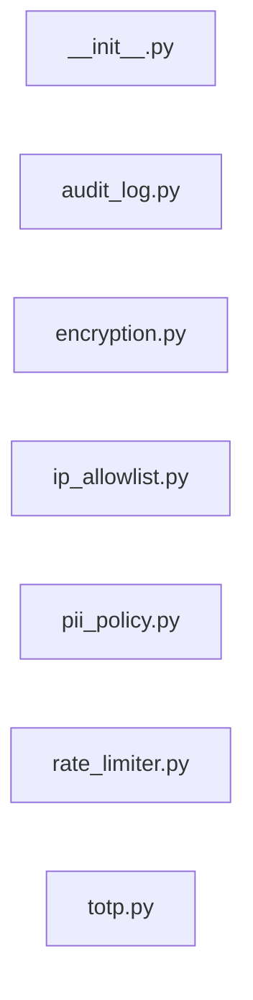

# `app/security/` — 7 module(s)

7 module(s).

## Dependencies

## `py:app/security/__init__.py`

- fan-in: 0, fan-out: 0

### Symbols
  _(no extracted symbols)_

## `py:app/security/audit_log.py`

- fan-in: 80, fan-out: 4

### Symbols
  - `audit` (function) → py:app/security/audit_log.py:9 — `def audit(`

## `py:app/security/encryption.py`

- fan-in: 27, fan-out: 3

### Symbols
  - `encrypt` (function) → py:app/security/encryption.py:8 — `def encrypt(value: str) -> bytes:`
  - `decrypt` (function) → py:app/security/encryption.py:13 — `def decrypt(token: bytes) -> str:`
  - `sha256_hash` (function) → py:app/security/encryption.py:18 — `def sha256_hash(value: str) -> str:`
  - `generate_thumbprint` (function) → py:app/security/encryption.py:23 — `def generate_thumbprint(email: str, phone: str) -> str:`
  - `schema_name_from_thumbprint` (function) → py:app/security/encryption.py:29 — `def schema_name_from_thumbprint(thumbprint: str) -> str:`

## `py:app/security/ip_allowlist.py`

- fan-in: 0, fan-out: 2

### Symbols
  - `require_server_ip` (function) → py:app/security/ip_allowlist.py:5 — `def require_server_ip(request: Request) -> None:`

## `py:app/security/pii_policy.py`

- fan-in: 0, fan-out: 0

### Symbols
  _(no extracted symbols)_

## `py:app/security/rate_limiter.py`

- fan-in: 4, fan-out: 2

### Symbols
  _(no extracted symbols)_

## `py:app/security/totp.py`

- fan-in: 7, fan-out: 5

### Symbols
  - `generate_totp_secret` (function) → py:app/security/totp.py:8 — `def generate_totp_secret() -> str:`
  - `get_totp_uri` (function) → py:app/security/totp.py:12 — `def get_totp_uri(secret: str, account_name: str) -> str:`
  - `generate_qr_code_base64` (function) → py:app/security/totp.py:19 — `def generate_qr_code_base64(uri: str) -> str:`
  - `verify_totp` (function) → py:app/security/totp.py:27 — `def verify_totp(secret: str, code: str) -> bool:`
