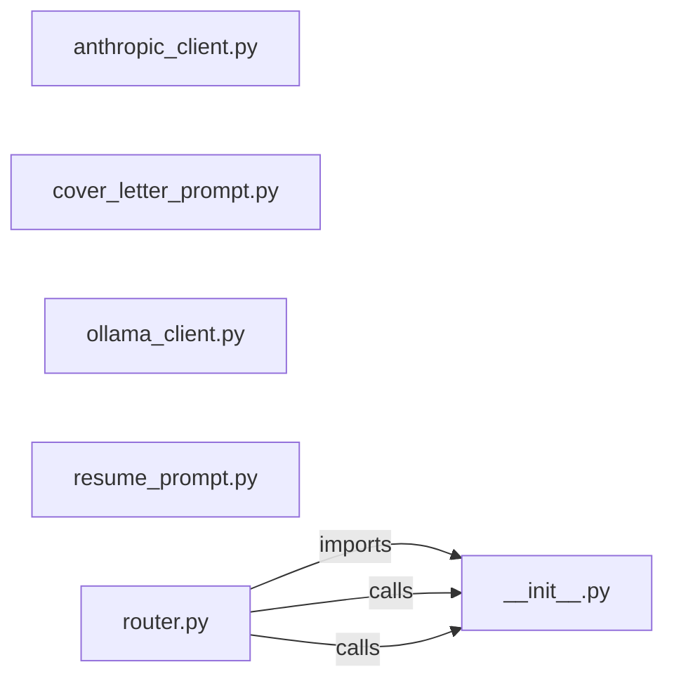

# `app/llm/` — 6 module(s)

6 module(s).

## Dependencies

## `py:app/llm/__init__.py`

- fan-in: 9, fan-out: 0

### Symbols
  _(no extracted symbols)_

## `py:app/llm/anthropic_client.py`

- fan-in: 0, fan-out: 3

### Symbols
  - `_get_client` (function) → py:app/llm/anthropic_client.py:10 — `def _get_client() -> anthropic.AsyncAnthropic:`
  - `generate` (function) → py:app/llm/anthropic_client.py:17 — `async def generate(prompt: str, system_prompt: str = "") -> str:`

## `py:app/llm/cover_letter_prompt.py`

- fan-in: 3, fan-out: 0

### Symbols
  - `build_cover_letter_prompt` (function) → py:app/llm/cover_letter_prompt.py:1 — `def build_cover_letter_prompt(`

## `py:app/llm/ollama_client.py`

- fan-in: 0, fan-out: 3

### Symbols
  - `generate` (function) → py:app/llm/ollama_client.py:8 — `async def generate(prompt: str, system_prompt: str = "") -> str:`

## `py:app/llm/resume_prompt.py`

- fan-in: 3, fan-out: 0

### Symbols
  - `build_resume_tailoring_prompt` (function) → py:app/llm/resume_prompt.py:1 — `def build_resume_tailoring_prompt(`

## `py:app/llm/router.py`

- fan-in: 0, fan-out: 4

### Symbols
  - `generate` (function) → py:app/llm/router.py:7 — `async def generate(prompt: str, user_llm_choice: str, system_prompt: str = "") -> str:`
