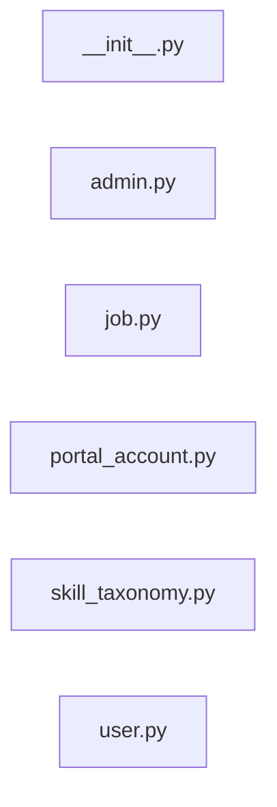

# `app/models/` — 6 module(s)

6 module(s).

## Dependencies

## `py:app/models/__init__.py`

- fan-in: 1, fan-out: 0

### Symbols
  _(no extracted symbols)_

## `py:app/models/admin.py`

- fan-in: 7, fan-out: 6

### Symbols
  - `AdminRole` (class) → py:app/models/admin.py:9 — `class AdminRole(str, enum.Enum):`
  - `AdminUser` (class) → py:app/models/admin.py:16 — `class AdminUser(Base):`

## `py:app/models/job.py`

- fan-in: 1, fan-out: 5

### Symbols
  - `Job` (class) → py:app/models/job.py:12 — `class Job(Base):`

## `py:app/models/portal_account.py`

- fan-in: 4, fan-out: 6

### Symbols
  - `PortalName` (class) → py:app/models/portal_account.py:9 — `class PortalName(str, enum.Enum):`
  - `PortalAccountHealth` (class) → py:app/models/portal_account.py:18 — `class PortalAccountHealth(str, enum.Enum):`
  - `SystemPortalAccount` (class) → py:app/models/portal_account.py:25 — `class SystemPortalAccount(Base):`

## `py:app/models/skill_taxonomy.py`

- fan-in: 8, fan-out: 6

### Symbols
  - `TaxonomyStatus` (class) → py:app/models/skill_taxonomy.py:9 — `class TaxonomyStatus(str, enum.Enum):`
  - `TaxonomySource` (class) → py:app/models/skill_taxonomy.py:15 — `class TaxonomySource(str, enum.Enum):`
  - `SkillTaxonomy` (class) → py:app/models/skill_taxonomy.py:22 — `class SkillTaxonomy(Base):`

## `py:app/models/user.py`

- fan-in: 27, fan-out: 6

### Symbols
  - `OAuthProvider` (class) → py:app/models/user.py:9 — `class OAuthProvider(str, enum.Enum):`
  - `UserTier` (class) → py:app/models/user.py:16 — `class UserTier(str, enum.Enum):`
  - `User` (class) → py:app/models/user.py:22 — `class User(Base):`
