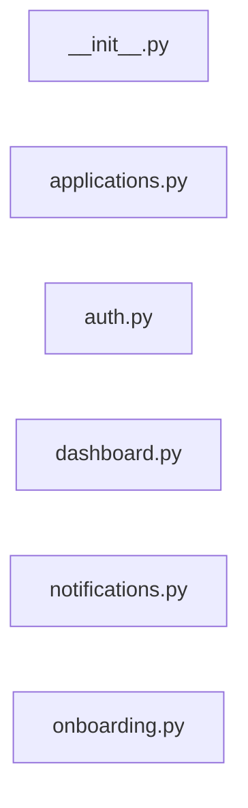

# `app/routers/` — 6 module(s)

6 module(s).

## Dependencies

## `py:app/routers/__init__.py`

- fan-in: 1, fan-out: 0

### Symbols
  _(no extracted symbols)_

## `py:app/routers/applications.py`

- fan-in: 18, fan-out: 28

### Symbols
  - `PauseRequest` (class) → py:app/routers/applications.py:20 — `class PauseRequest(BaseModel):`
  - `CompanyBlacklistRequest` (class) → py:app/routers/applications.py:24 — `class CompanyBlacklistRequest(BaseModel):`
  - `TitleBlacklistRequest` (class) → py:app/routers/applications.py:28 — `class TitleBlacklistRequest(BaseModel):`
  - `AccountDeletionRequest` (class) → py:app/routers/applications.py:32 — `class AccountDeletionRequest(BaseModel):`
  - `list_applications` (function) → py:app/routers/applications.py:37 — `async def list_applications(`
  - `get_application` (function) → py:app/routers/applications.py:73 — `async def get_application(`
  - `withdraw_application` (function) → py:app/routers/applications.py:115 — `async def withdraw_application(`
  - `pause_auto_apply` (function) → py:app/routers/applications.py:130 — `async def pause_auto_apply(`
  - `resume_auto_apply` (function) → py:app/routers/applications.py:146 — `async def resume_auto_apply(`
  - `add_company_blacklist` (function) → py:app/routers/applications.py:161 — `async def add_company_blacklist(`
  - `remove_company_blacklist` (function) → py:app/routers/applications.py:179 — `async def remove_company_blacklist(`
  - `add_title_blacklist` (function) → py:app/routers/applications.py:194 — `async def add_title_blacklist(`
  - `remove_title_blacklist` (function) → py:app/routers/applications.py:212 — `async def remove_title_blacklist(`
  - `get_blacklists` (function) → py:app/routers/applications.py:227 — `async def get_blacklists(`
  - `delete_account` (function) → py:app/routers/applications.py:242 — `async def delete_account(`

## `py:app/routers/auth.py`

- fan-in: 0, fan-out: 33

### Symbols
  - `login` (function) → py:app/routers/auth.py:22 — `async def login(request: Request, provider: str):`
  - `callback` (function) → py:app/routers/auth.py:31 — `async def callback(request: Request, provider: str, db: AsyncSession = Depends(get_db)):`
  - `verify_totp_code` (function) → py:app/routers/auth.py:128 — `async def verify_totp_code(`
  - `logout` (function) → py:app/routers/auth.py:156 — `async def logout(`

## `py:app/routers/dashboard.py`

- fan-in: 0, fan-out: 9

### Symbols
  - `get_dashboard` (function) → py:app/routers/dashboard.py:13 — `async def get_dashboard(`

## `py:app/routers/notifications.py`

- fan-in: 2, fan-out: 14

### Symbols
  - `notification_ws` (function) → py:app/routers/notifications.py:19 — `async def notification_ws(websocket: WebSocket, user_id: str):`
  - `push_to_user` (function) → py:app/routers/notifications.py:31 — `async def push_to_user(user_id: str, payload: dict) -> None:`
  - `list_notifications` (function) → py:app/routers/notifications.py:41 — `async def list_notifications(`
  - `mark_read` (function) → py:app/routers/notifications.py:62 — `async def mark_read(`
  - `unread_count` (function) → py:app/routers/notifications.py:76 — `async def unread_count(`
  - `mark_all_read` (function) → py:app/routers/notifications.py:89 — `async def mark_all_read(`

## `py:app/routers/onboarding.py`

- fan-in: 0, fan-out: 49

### Symbols
  - `Step1PersonalData` (class) → py:app/routers/onboarding.py:25 — `class Step1PersonalData(BaseModel):`
  - `Step2ProfessionalData` (class) → py:app/routers/onboarding.py:32 — `class Step2ProfessionalData(BaseModel):`
  - `Step3ExperienceData` (class) → py:app/routers/onboarding.py:37 — `class Step3ExperienceData(BaseModel):`
  - `Step4PreferencesData` (class) → py:app/routers/onboarding.py:42 — `class Step4PreferencesData(BaseModel):`
  - `Step5SkillsData` (class) → py:app/routers/onboarding.py:56 — `class Step5SkillsData(BaseModel):`
  - `Step6LLMChoiceData` (class) → py:app/routers/onboarding.py:60 — `class Step6LLMChoiceData(BaseModel):`
  - `Step7NotificationData` (class) → py:app/routers/onboarding.py:65 — `class Step7NotificationData(BaseModel):`
  - `Step9ConsentData` (class) → py:app/routers/onboarding.py:71 — `class Step9ConsentData(BaseModel):`
  - `get_onboarding_status` (function) → py:app/routers/onboarding.py:78 — `async def get_onboarding_status(user: User = Depends(get_current_user)):`
  - `step1_personal` (function) → py:app/routers/onboarding.py:87 — `async def step1_personal(`
  - `step2_professional` (function) → py:app/routers/onboarding.py:143 — `async def step2_professional(`
  - `step3_experience` (function) → py:app/routers/onboarding.py:164 — `async def step3_experience(`
  - `step4_preferences` (function) → py:app/routers/onboarding.py:186 — `async def step4_preferences(`
  - `step5_skills` (function) → py:app/routers/onboarding.py:214 — `async def step5_skills(`
  - `step5_resume_upload` (function) → py:app/routers/onboarding.py:235 — `async def step5_resume_upload(`
  - `step6_llm_choice` (function) → py:app/routers/onboarding.py:253 — `async def step6_llm_choice(`
  - `step7_notifications` (function) → py:app/routers/onboarding.py:273 — `async def step7_notifications(`
  - `step9_consent` (function) → py:app/routers/onboarding.py:298 — `async def step9_consent(`
