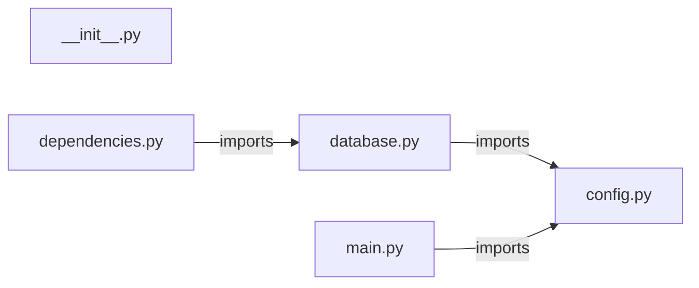

# `app/` — 5 module(s)

5 module(s).

## Dependencies

## `py:app/__init__.py`

- fan-in: 0, fan-out: 0

### Symbols
  _(no extracted symbols)_

## `py:app/config.py`

- fan-in: 24, fan-out: 3

### Symbols
  - `Settings` (class) → py:app/config.py:6 — `class Settings(BaseSettings):`

## `py:app/database.py`

- fan-in: 78, fan-out: 4

### Symbols
  - `Base` (class) → py:app/database.py:22 — `class Base(DeclarativeBase):`
  - `get_db` (function) → py:app/database.py:26 — `async def get_db():`
  - `get_tenant_db` (function) → py:app/database.py:34 — `async def get_tenant_db(schema_name: str):`
  - `provision_user_schema` (function) → py:app/database.py:44 — `async def provision_user_schema(schema_name: str) -> None:`

## `py:app/dependencies.py`

- fan-in: 22, fan-out: 10

### Symbols
  - `get_current_user` (function) → py:app/dependencies.py:11 — `async def get_current_user(`
  - `get_current_admin` (function) → py:app/dependencies.py:35 — `async def get_current_admin(`
  - `require_role` (function) → py:app/dependencies.py:55 — `def require_role(*roles: AdminRole):`

## `py:app/main.py`

- fan-in: 2, fan-out: 20

### Symbols
  - `health` (function) → py:app/main.py:81 — `async def health():`
  - `global_exception_handler` (function) → py:app/main.py:86 — `async def global_exception_handler(request: Request, exc: Exception):`
