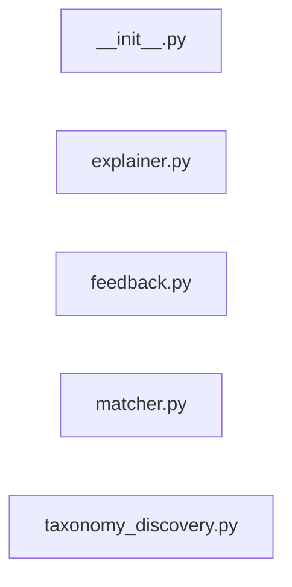

# `app/ml/` — 5 module(s)

5 module(s).

## Dependencies

## `py:app/ml/__init__.py`

- fan-in: 0, fan-out: 0

### Symbols
  _(no extracted symbols)_

## `py:app/ml/explainer.py`

- fan-in: 2, fan-out: 0

### Symbols
  - `format_explanation` (function) → py:app/ml/explainer.py:6 — `def format_explanation(match_result: dict) -> str:`
  - `dashboard_explainability` (function) → py:app/ml/explainer.py:30 — `def dashboard_explainability(match_result: dict) -> dict:`

## `py:app/ml/feedback.py`

- fan-in: 10, fan-out: 7

### Symbols
  - `record_outcome` (function) → py:app/ml/feedback.py:14 — `async def record_outcome(`
  - `compute_user_score_adjustment` (function) → py:app/ml/feedback.py:36 — `async def compute_user_score_adjustment(tenant_db: AsyncSession) -> dict:`

## `py:app/ml/matcher.py`

- fan-in: 32, fan-out: 6

### Symbols
  - `_get_st_model` (function) → py:app/ml/matcher.py:22 — `def _get_st_model():`
  - `compute_match` (function) → py:app/ml/matcher.py:33 — `def compute_match(`
  - `_tfidf_match` (function) → py:app/ml/matcher.py:60 — `def _tfidf_match(user_skills: list[str], job_skills: list[str]) -> dict:`
  - `_semantic_match` (function) → py:app/ml/matcher.py:96 — `def _semantic_match(user_skills: list[str], job_skills: list[str]) -> dict:`
  - `meets_threshold` (function) → py:app/ml/matcher.py:140 — `def meets_threshold(match_result: dict, threshold: float) -> bool:`

## `py:app/ml/taxonomy_discovery.py`

- fan-in: 29, fan-out: 8

### Symbols
  - `extract_candidate_skills` (function) → py:app/ml/taxonomy_discovery.py:31 — `def extract_candidate_skills(jd_text: str, known_skills: set[str]) -> list[str]:`
  - `queue_discovered_skills` (function) → py:app/ml/taxonomy_discovery.py:47 — `async def queue_discovered_skills(`
  - `SoftSignals` (class) → py:app/ml/taxonomy_discovery.py:90 — `class SoftSignals:`
  - `activate_soft_signals` (function) → py:app/ml/taxonomy_discovery.py:113 — `def activate_soft_signals():`
