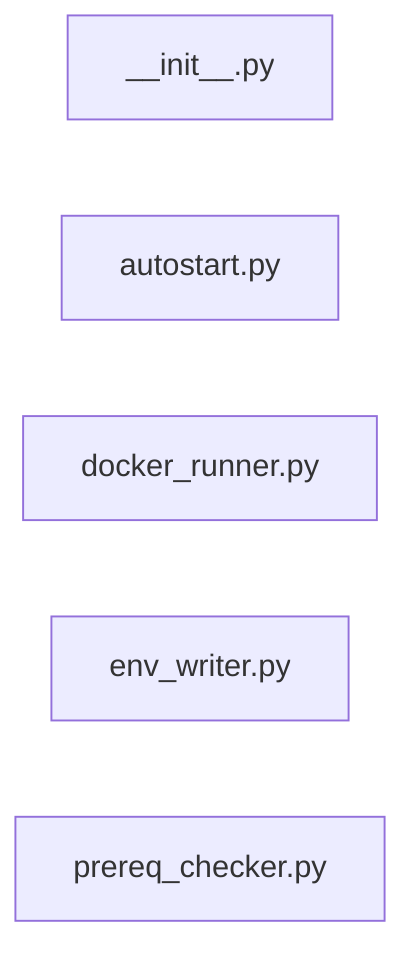

# `installer/core/` — 5 module(s)

5 module(s).

## Dependencies

## `py:installer/core/__init__.py`

- fan-in: 7, fan-out: 0

### Symbols
  _(no extracted symbols)_

## `py:installer/core/autostart.py`

- fan-in: 0, fan-out: 4

### Symbols
  - `_register_windows` (function) → py:installer/core/autostart.py:8 — `def _register_windows(install_dir: str) -> bool:`
  - `_register_linux` (function) → py:installer/core/autostart.py:36 — `def _register_linux(install_dir: str) -> bool:`
  - `_register_macos` (function) → py:installer/core/autostart.py:81 — `def _register_macos(install_dir: str) -> bool:`
  - `register_autostart` (function) → py:installer/core/autostart.py:135 — `def register_autostart(install_dir: str) -> bool:`

## `py:installer/core/docker_runner.py`

- fan-in: 0, fan-out: 8

### Symbols
  - `_copy_compose_files` (function) → py:installer/core/docker_runner.py:23 — `def _copy_compose_files(install_dir: str) -> list:`
  - `_build_compose_cmd` (function) → py:installer/core/docker_runner.py:41 — `def _build_compose_cmd(install_dir: str, subcmd: list) -> list:`
  - `_stream_process` (function) → py:installer/core/docker_runner.py:51 — `def _stream_process(cmd: list, cwd: str, log_callback, encoding="utf-8"):`
  - `_wait_for_health` (function) → py:installer/core/docker_runner.py:72 — `def _wait_for_health(progress_callback, log_callback) -> bool:`
  - `run_install` (function) → py:installer/core/docker_runner.py:94 — `def run_install(install_dir: str, progress_callback, log_callback) -> bool:`

## `py:installer/core/env_writer.py`

- fan-in: 14, fan-out: 6

### Symbols
  - `_fernet_key` (function) → py:installer/core/env_writer.py:7 — `def _fernet_key() -> str:`
  - `_db_url` (function) → py:installer/core/env_writer.py:19 — `def _db_url(config: dict) -> str:`
  - `write_env` (function) → py:installer/core/env_writer.py:31 — `def write_env(config: dict, install_dir: str) -> str:`

## `py:installer/core/prereq_checker.py`

- fan-in: 6, fan-out: 5

### Symbols
  - `_port_available` (function) → py:installer/core/prereq_checker.py:17 — `def _port_available(port: int) -> bool:`
  - `_check_docker_installed` (function) → py:installer/core/prereq_checker.py:26 — `def _check_docker_installed() -> dict:`
  - `_check_docker_running` (function) → py:installer/core/prereq_checker.py:44 — `def _check_docker_running() -> dict:`
  - `_check_port` (function) → py:installer/core/prereq_checker.py:65 — `def _check_port(port: int, service: str) -> dict:`
  - `_check_disk_space` (function) → py:installer/core/prereq_checker.py:75 — `def _check_disk_space(path: str = None) -> dict:`
  - `check_all` (function) → py:installer/core/prereq_checker.py:98 — `def check_all(install_path: str = None) -> list:`
  - `is_critical_failure` (function) → py:installer/core/prereq_checker.py:109 — `def is_critical_failure(results: list) -> bool:`
