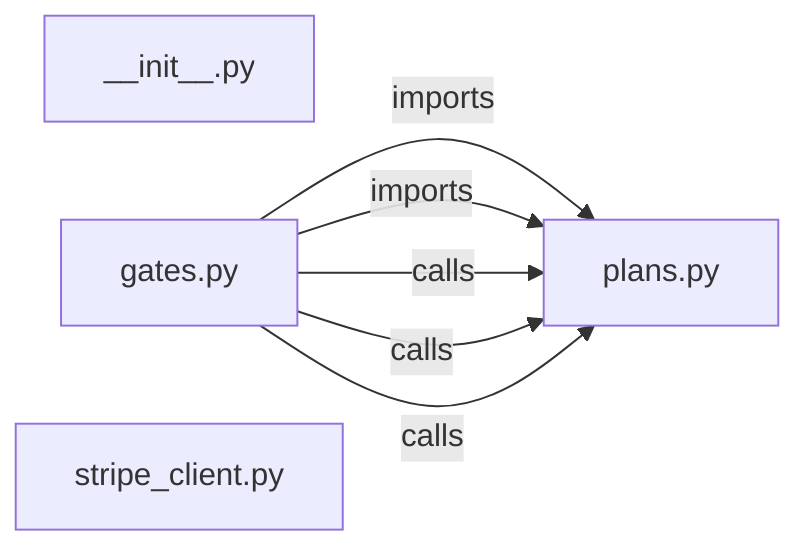

# `app/billing/` — 4 module(s)

4 module(s).

## Dependencies

## `py:app/billing/__init__.py`

- fan-in: 0, fan-out: 0

### Symbols
  _(no extracted symbols)_

## `py:app/billing/gates.py`

- fan-in: 33, fan-out: 6

### Symbols
  - `can_use_portal` (function) → py:app/billing/gates.py:9 — `def can_use_portal(user: User, portal_count: int) -> bool:`
  - `can_apply_today` (function) → py:app/billing/gates.py:16 — `def can_apply_today(user: User, applied_today: int, cap: int) -> bool:`
  - `can_use_llm_api` (function) → py:app/billing/gates.py:24 — `def can_use_llm_api(user: User) -> bool:`
  - `activate_plan` (function) → py:app/billing/gates.py:31 — `def activate_plan(tier: str) -> None:`

## `py:app/billing/plans.py`

- fan-in: 12, fan-out: 1

### Symbols
  - `Plan` (class) → py:app/billing/plans.py:9 — `class Plan:`

## `py:app/billing/stripe_client.py`

- fan-in: 0, fan-out: 0

### Symbols
  - `create_checkout_session` (function) → py:app/billing/stripe_client.py:11 — `def create_checkout_session(user_id: str, plan: str) -> str:`
  - `handle_webhook` (function) → py:app/billing/stripe_client.py:15 — `def handle_webhook(payload: bytes, sig_header: str) -> dict:`
