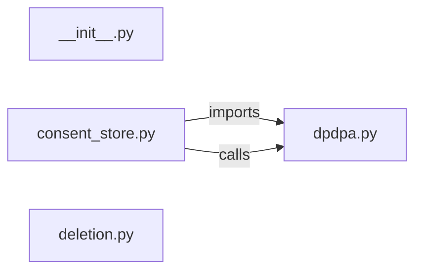

# `app/compliance/` — 4 module(s)

4 module(s).

## Dependencies

## `py:app/compliance/__init__.py`

- fan-in: 0, fan-out: 0

### Symbols
  _(no extracted symbols)_

## `py:app/compliance/consent_store.py`

- fan-in: 2, fan-out: 5

### Symbols
  - `record_consent` (function) → py:app/compliance/consent_store.py:21 — `async def record_consent(`

## `py:app/compliance/deletion.py`

- fan-in: 13, fan-out: 9

### Symbols
  - `DeletionMode` (class) → py:app/compliance/deletion.py:12 — `class DeletionMode(str, Enum):`
  - `execute_deletion` (function) → py:app/compliance/deletion.py:18 — `async def execute_deletion(`
  - `_hard_delete` (function) → py:app/compliance/deletion.py:35 — `async def _hard_delete(user: User, db: AsyncSession) -> dict:`
  - `_soft_delete` (function) → py:app/compliance/deletion.py:49 — `async def _soft_delete(user: User, db: AsyncSession) -> dict:`
  - `_anonymise` (function) → py:app/compliance/deletion.py:68 — `async def _anonymise(user: User, db: AsyncSession) -> dict:`

## `py:app/compliance/dpdpa.py`

- fan-in: 3, fan-out: 5

### Symbols
  - `ConsentRecord` (class) → py:app/compliance/dpdpa.py:12 — `class ConsentRecord(Base):`
