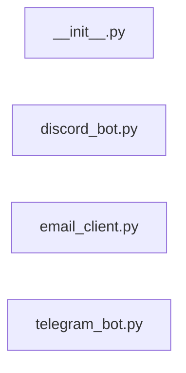

# `app/notifications/` — 4 module(s)

4 module(s).

## Dependencies

## `py:app/notifications/__init__.py`

- fan-in: 4, fan-out: 0

### Symbols
  _(no extracted symbols)_

## `py:app/notifications/discord_bot.py`

- fan-in: 0, fan-out: 6

### Symbols
  - `_run_bot` (function) → py:app/notifications/discord_bot.py:14 — `def _run_bot():`
  - `start_discord_bot` (function) → py:app/notifications/discord_bot.py:25 — `def start_discord_bot():`
  - `send_to_channel` (function) → py:app/notifications/discord_bot.py:31 — `async def send_to_channel(channel_id: str, text: str) -> bool:`
  - `provision_user_channel` (function) → py:app/notifications/discord_bot.py:49 — `async def provision_user_channel(user_display_name: str) -> str | None:`

## `py:app/notifications/email_client.py`

- fan-in: 0, fan-out: 7

### Symbols
  - `send_email` (function) → py:app/notifications/email_client.py:14 — `async def send_email(to: str, subject: str, body_html: str) -> bool:`
  - `_send_sendgrid` (function) → py:app/notifications/email_client.py:24 — `async def _send_sendgrid(to: str, subject: str, body_html: str) -> bool:`
  - `_send_smtp` (function) → py:app/notifications/email_client.py:45 — `async def _send_smtp(to: str, subject: str, body_html: str) -> bool:`

## `py:app/notifications/telegram_bot.py`

- fan-in: 0, fan-out: 4

### Symbols
  - `get_bot` (function) → py:app/notifications/telegram_bot.py:10 — `def get_bot():`
  - `send_message` (function) → py:app/notifications/telegram_bot.py:18 — `async def send_message(chat_id: str, text: str) -> bool:`
  - `get_bot_link` (function) → py:app/notifications/telegram_bot.py:31 — `def get_bot_link(user_id: str) -> str:`
