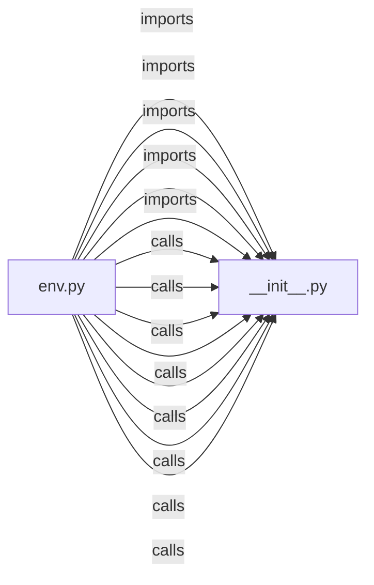

# `alembic/` — 2 module(s)

2 module(s).

## Dependencies

## `py:alembic/__init__.py`

- fan-in: 49, fan-out: 0

### Symbols
  _(no extracted symbols)_

## `py:alembic/env.py`

- fan-in: 0, fan-out: 23

### Symbols
  - `_include_object` (function) → py:alembic/env.py:62 — `def _include_object(obj, name, type_, reflected, compare_to):`
  - `_configure_for_schema` (function) → py:alembic/env.py:71 — `def _configure_for_schema(connection, schema: str | None = None):`
  - `run_migrations_offline` (function) → py:alembic/env.py:90 — `def run_migrations_offline() -> None:`
  - `run_migrations_online` (function) → py:alembic/env.py:105 — `def run_migrations_online() -> None:`
  - `run_tenant_migrations` (function) → py:alembic/env.py:123 — `def run_tenant_migrations(schema_name: str, database_url: str | None = None) -> None:`
