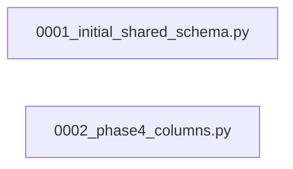

# `alembic/versions/` — 2 module(s)

2 module(s).

## Dependencies

## `py:alembic/versions/0001_initial_shared_schema.py`

- fan-in: 0, fan-out: 33

### Symbols
  - `upgrade` (function) → py:alembic/versions/0001_initial_shared_schema.py:20 — `def upgrade() -> None:`
  - `downgrade` (function) → py:alembic/versions/0001_initial_shared_schema.py:234 — `def downgrade() -> None:`

## `py:alembic/versions/0002_phase4_columns.py`

- fan-in: 0, fan-out: 6

### Symbols
  - `upgrade` (function) → py:alembic/versions/0002_phase4_columns.py:21 — `def upgrade() -> None:`
  - `downgrade` (function) → py:alembic/versions/0002_phase4_columns.py:37 — `def downgrade() -> None:`
