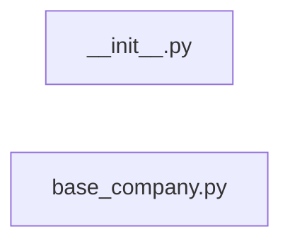

# `app/crawlers/company_pages/` — 2 module(s)

2 module(s).

## Dependencies

## `py:app/crawlers/company_pages/__init__.py`

- fan-in: 0, fan-out: 0

### Symbols
  _(no extracted symbols)_

## `py:app/crawlers/company_pages/base_company.py`

- fan-in: 0, fan-out: 7

### Symbols
  - `BaseCompanyCrawler` (class) → py:app/crawlers/company_pages/base_company.py:11 — `class BaseCompanyCrawler(BaseCrawler, ABC):`
